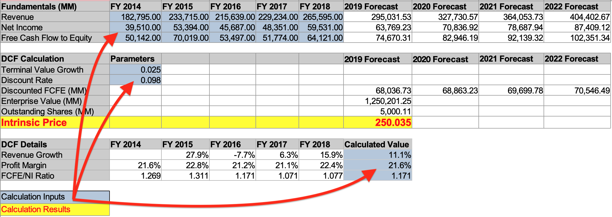

# Overview

A financial calculator capable of determining the instrinsic value of a company by performing a discounted cashflow analysis.

This calculator requires access to financial statements and stock prices to 
perform its calculations. This data is provided by Intrinio, and you should sign up for an access to key before using this software. You may sign up for sandbox access which will give you data on roughly 30 securities.

## The model
The Discounted Cash Flow model is simple to implement and requires only 3 imputs: A cashflow forecast for 4-5 years in the future, a long term growth rate and a discount rate. Although the formula is straight forward, getting the inputs right is not, and so the current implementation takes a very simplistic approach to this.

1) Discount rate is hardcoded, to 9.75% and can be changed programmatically.
2) The long term growth rate is is also hardcoded and set to the 10 year TBILL rate or 1.75%
3) Cash flow forecast is based on a modified version of the "Jimmy" Method (https://www.youtube.com/watch?v=fd_emLLzJnk&t=500s), but it's essentially based on past history.

Over time, additional more sophisticated models will be made available.


## Prerequisites

### API Keys
An API Key for the Intrinio (https://www.intrinio.com) with access to the "US Fundamentals and Stock Prices" feeds

the API should be saved to the environment like so:

```export INTRINIO_API_KEY=[your API key]```

### Installing requirements
```
  pip install -r requirements.txt
```

You may run this in a virtual environment like so:

```
python3 -m venv venv
source venv/bin/activate
pip install -r requirements.txt
```

## Running the script
The calculation can be done either for an individual stock or a file containing a list of them.

The file should contain a signle ticker per line. As an example, see ```ticker-list.txt```

```
python valuate_security.py -h
usage: valuate_security.py [-h] [-ticker TICKER] [-ticker-file TICKER_FILE]
                           year

Performs a DCF analisys of a stock and returns the intrinsic price. The
parameters are a ticker symbol (or file containing one symbol per line) and
a year represending the most recent available year end reports. The year also
represents the date of the intrinsic price. So for example, if the supplied
parameters are "AAPL" and "2018", then the output will be the price for AAPL
during Q4 2018.

positional arguments:
  year                  Year of the most recent year end financial statements

optional arguments:
  -h, --help            show this help message and exit
  -ticker TICKER        Ticker Symbol
  -ticker-file TICKER_FILE
                        Ticker Symbol file

```

Examples:

```
python valuate_security.py -ticker-file ticker-list.txt 2018
python valuate_security.py -ticker aapl 2018
```

## Output

### Command Line Output
```
> python valuate_security.py -ticker aapl 2018

[INFO] - Tiker: AAPL, Intrinsic Price: 250.034799, Current Price: 248.760000
```

### Spreadsheet output
The script will also generate a spreadhseet based report that includes the details of the DCF calculation. Unlike a report which just displays the result of the calculation, this spreadhseet re-implements much of the calculation and you may tweak any of the inputs and see how that affects the final price. This is useful for fine tuning the results of the calculation.

Spreadhseets are stored in the ```reports``` folder relative to the main
script using a name pattern of ```ticker-fiscal_year.xlsx```



## Caching of financial data
All financial data is saved to a local cache since the data is usually immutable. As of this version the data is set to never expire, and the cache will grow to a maximum size of 4GB.

The cache is located in the following path:

```
./financial-data/
./financial-data/cache.db
```

To delete or reset the contents of the cache, simply delete entire ```./financial-data/``` folder


### Spreadsheet output
The script will also generate a spreadhseet based report that includes the details of the DCF calculation. Unlike a report which just displays the result of the calculation, this spreadhseet re-implements much of the calculation and you may tweak any of the inputs and see how that affects the final price. This is useful for fine tuning the results of the calculation.

Spreadhseets are stored in the ```reports``` folder relative to the main
script using a name pattern of ```ticker-fiscal_year.xlsx```


## Unit Tests
You may run all unit tests using this command:

```./test.sh```

This command will execute all unit tests and run the coverage report (using coverage.py)

```
>./test.sh
----------------------------------------------------------------------
Ran 48 tests in 0.082s

OK
Name                              Stmts   Miss  Cover
-----------------------------------------------------
data_provider/intrinio_data.py       98     23    77%
data_provider/intrinio_util.py       13      0   100%
dcf_models/base_model.py             36      2    94%
dcf_models/jimmy_model.py           106     12    89%
exception/exceptions.py              27      1    96%
financial/calculator.py              62      2    97%
reporting/jimmy_dcf_report.py        35     23    34%
reporting/spreadsheet_report.py      36      2    94%
run_tests.py                         12      0   100%
support/financial_cache.py           29      0   100%
support/util.py                      11      1    91%
-----------------------------------------------------
TOTAL                               465     66    86%
```

## Future enhancements
1) Perform TTM estimates when a year end financial report does not yet exist.
2) Calculate Cost of Capital using CAPM forumla.
3) Throw exception when a security is not a good candidate for this model instead of proceeding with the calculation.
4) More models
